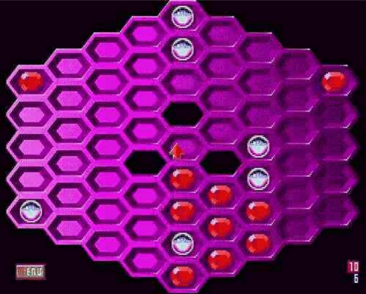

## Задание 7 Написать программу играющую в ГЕКСАГОН.

Hexxagon — это игра в жанрах стратегии и настольные, разработанная Argo Games, Alexey Volovik и Aleksejs Voloviks. Она была выпущена в 1993. Software Creations выступила издателем игры.

Поле состоит из 6-гранных клеток. Размер поля – по выбору.
Два игрока ходят по очереди. Возможны ходы:
1) Поставить новую свою шашку на любую свободную из 6 клеток, смежных со своей
шашкой.
2) Переставить свою шашку на любую свободную клетку, смежную с клетками, смежными
с прежним положением этой шашки.
В любом случае, если на клетках, смежных с новым положением своей шашки, есть
шашки противника, они заменяются на свои.
Игра заканчивается, когда все клетки заняты. Выигрывает тот, кто занял больше клеток.

[Отчет в папке docs](https://github.com/GoreevArtem/Hex/blob/master/docs/ТП_19_ИСТ_2_Гореев_Артем_Дмитриевич_КР_03АБ.pdf)
